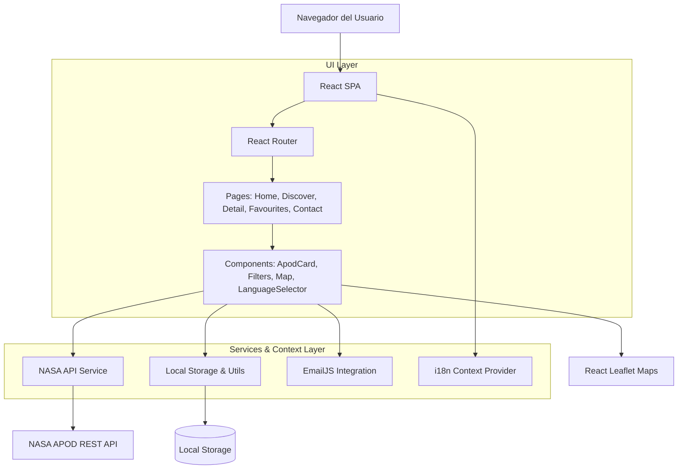

# 🚀 APOD Explorer
Una plataforma interactiva para descubrir, filtrar y guardar las Imágenes Astronómicas del Día (APOD) de la NASA. Desarrollada para ofrecer una experiencia inmersiva con soporte multi-idioma, persistencia local y mapas interactivos.


---

## 📸 Preview
> 💡 *Sugerencia: Inserta aquí un GIF navegando por la vista Discover, agregando una imagen a favoritos y cambiando el idioma de la aplicación.*

---

## 📖 Sobre el Proyecto
APOD Explorer nace con el propósito de acercar las maravillas del cosmos a los usuarios, proporcionando una interfaz moderna y rápida para consumir la API pública de la NASA. El proyecto no solo busca mostrar imágenes, sino ofrecer una experiencia completa: permitiendo a los usuarios filtrar fotografías por rangos de fechas, mantener un historial de navegación, crear su colección de favoritos y explorar mapas interactivos. Todo esto manteniendo una arquitectura escalable en el lado del cliente (SPA) y sin necesidad de un backend propio, logrando una latencia mínima y un despliegue Serverless.

---

## ✨ Características Principales
- **🌌 Exploración Cósmica:** Consumo directo de la API de la NASA APOD para mostrar la imagen astronómica diaria e imágenes aleatorias.
- **🔍 Filtrado Avanzado:** Búsqueda precisa de imágenes dentro de rangos de fechas específicos.
- **⭐ Favoritos e Historial:** Persistencia de datos en el cliente (Local Storage) para guardar imágenes favoritas y registrar el historial de vistas recientes.
- **🗺️ Mapas Interactivos:** Integración con Leaflet para características de geolocalización o mapas temáticos dentro de la experiencia de usuario.
- **🌍 Soporte Multi-idioma (i18n):** Internacionalización nativa mediante Context API, permitiendo a los usuarios cambiar el idioma de la aplicación en tiempo real.
- **📧 Contacto Directo:** Formulario de contacto funcional utilizando EmailJS sin necesidad de levantar un servidor de correos backend.

---

## 🏗️ Arquitectura y Diagramas
El proyecto sigue una arquitectura basada en componentes con una clara Separación de Preocupaciones (Separation of Concerns). La capa de UI está completamente desacoplada de la lógica de negocio y las peticiones a la red.



### 📂 Estructura Principal
```plaintext
src/
├── components/   # Componentes de UI reusables (Header, Footer, ApodCard, Map, Filters, etc.)
├── i18n/         # Configuración y Provider para la internacionalización de la app
├── models/       # Interfaces y tipados de TypeScript (ej. Apod.ts)
├── pages/        # Vistas ruteables de la aplicación (Home, Discover, Contact, etc.)
└── services/     # Lógica de negocio, peticiones HTTP y manejo de Local Storage
```

---

## 🛠️ Tecnologías Utilizadas

### Frontend
- **React (v19):** Librería principal para la construcción de la interfaz de usuario basada en componentes.
- **TypeScript:** Superset de JS para garantizar consistencia en los tipos (ej. payload de la API) y prevenir errores en tiempo de ejecución.
- **Vite:** Bundler de nueva generación que provee un entorno de desarrollo extremadamente rápido y un build optimizado.
- **React Router (v7):** Enrutamiento del lado del cliente (HashRouter) para la navegación entre las diferentes páginas sin recargar.
- **Bootstrap:** Framework CSS para asegurar que los componentes sean responsivos y con un diseño estandarizado rápidamente.

### Herramientas & Ecosistema
- **React Leaflet:** Componentes de React para interactuar con mapas interactivos de Leaflet.
- **EmailJS:** Solución Serverless para enviar correos electrónicos directamente desde el cliente React.
- **Firebase Hosting:** Servicio de infraestructura utilizado para desplegar la aplicación estática de manera global.

---

## 🧠 Decisiones Técnicas y Highlights

- **Separación de Preocupaciones (Services Pattern):** Las llamadas a la API de la NASA (`apodService.ts`) y la lógica de almacenamiento local/utilidades (`internalFunctions.ts`) fueron abstraídas en su propio módulo. Esto evita tener *Fat Components* y hace que la lógica de negocio sea testeable y reutilizable.
- **Gestión de Estado Global (i18n):** Para el cambio de idioma, se diseñó un `LanguageProvider` utilizando React Context. Esto evita el *prop drilling* y permite que cualquier componente de la aplicación reaccione inmediatamente al cambio de preferencia lingüística.
- **Client-Side Persistence:** Se optó por utilizar `localStorage` para manejar los Favoritos y el Historial de lectura. Esto proporciona una sensación de cuenta de usuario y persistencia sin el overhead (costo y latencia) de configurar y mantener una base de datos externa.
- **Tipado Fuerte (Models):** La respuesta dinámica de la API de la NASA es validada e interceptada utilizando interfaces TypeScript. Esto asegura que el acceso a propiedades como `apod.date` o `apod.url` sea seguro en tiempo de compilación a lo largo de toda la aplicación.

---

## 🚀 Instalación y Despliegue

### Requisitos Previos
- Node.js (v18 o superior recomendado)
- npm o yarn

### Entorno de Desarrollo Local

<details>
<summary>Click para expandir instrucciones de instalación</summary>

1. Clonar el repositorio:
   ```bash
   git clone https://github.com/MaximilianoGimenez0/APOD-explorer.git
   cd APOD-explorer
   ```

2. Instalar dependencias:
   ```bash
   npm install
   ```

3. Levantar el servidor de desarrollo Vite:
   ```bash
   npm run dev
   ```
</details>

### Variables de Entorno Requeridas
Si deseas compilar o levantar el entorno, asegúrate de proveer las constantes en los archivos de servicio, como por ejemplo la `API_KEY` de la NASA y las configuraciones de `EmailJS`.

| Variable / Constante | Descripción | Entorno |
|----------------------|-------------|---------|
| `API_KEY`            | Llave pública o generada para consumir `api.nasa.gov` | `services/constats.ts` |
| `API_URL`            | URL base (`https://api.nasa.gov/planetary/apod`) | `services/constats.ts` |
| (EmailJS configs)    | Claves del servicio (Service ID, Template ID) para el formulario de contacto | Configuración EmailJS |

### Despliegue en Producción
El proyecto está configurado para desplegarse ágilmente en Firebase Hosting.

```bash
# 1. Generar la carpeta /dist con el bundle de producción
npm run build

# 2. Desplegar en Firebase (requiere firebase-tools)
firebase deploy --only hosting
```

---

## 👨‍💻 Autor

**Maximiliano Giménez** - Software Developer
- [GitHub](https://github.com/MaximilianoGimenez0)
- *Link a tu LinkedIn o Portfolio personal aquí*
