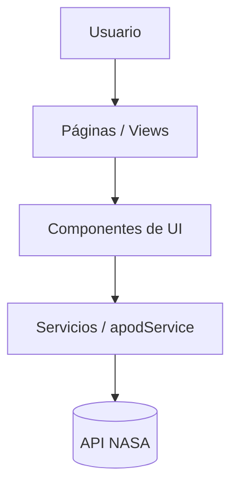

# 🚀 APOD Explorer

Un explorador web moderno e interactivo para visualizar y administrar las Imágenes Astronómicas del Día (APOD) de la NASA. Construido con React, TypeScript y Vite, enfocado en el rendimiento, la escalabilidad y una arquitectura modular sólida[cite: 1].


---

## 📸 Preview

> 💡 *Espacio reservado para GIF de demostración o capturas de pantalla de la aplicación en funcionamiento.*
> *(Inserta aquí un GIF mostrando el flujo: Home -> Lista -> Detalle -> Guardar Favorito)*

---

## 📖 Descripción

**APOD Explorer** resuelve el problema de consumir la vasta biblioteca de imágenes astronómicas de la NASA de una forma estructurada y amigable[cite: 1]. 

En lugar de simples consultas a la API, esta aplicación actúa como un catálogo personalizable donde los usuarios pueden filtrar imágenes, leer información detallada, mantener un historial de navegación e interactuar con mapas para imágenes geo-referenciadas[cite: 1]. El proyecto demuestra un dominio avanzado de las bases del desarrollo frontend moderno, aislando componentes de UI de la lógica de negocio a través de una sólida arquitectura orientada a servicios[cite: 1].

---

## ✨ Características Principales

*   **🌌 Exploración de Catálogo:** Listado paginado/infinito de imágenes astronómicas (`ApodList`, `ApodCard`)[cite: 1].
*   **⭐ Gestión de Favoritos:** Capacidad para guardar y administrar colecciones personales (`Favourites`, `FavouriteEntry`)[cite: 1].
*   **📖 Historial Inteligente:** Seguimiento automático de las imágenes previamente visualizadas por el usuario (`History`, `HistoryEntry`)[cite: 1].
*   **🔍 Filtros Avanzados:** Búsqueda y segmentación de datos específicos (`Filters`)[cite: 1].
*   **🗺️ Mapas Integrados:** Visualización de coordenadas asociadas mediante un componente dedicado (`Map.tsx`)[cite: 1].
*   **📝 Feedback Integrado:** Sistema de contacto y encuestas de satisfacción (`Contact`, `SurveyForm`)[cite: 1].

---

## 🛠️ Tecnologías Utilizadas

### Frontend
*   **React (TSX):** Renderizado de UI basado en componentes[cite: 1].
*   **TypeScript:** Tipado estático para prevenir errores en tiempo de compilación y mejorar la experiencia de desarrollo (DX)[cite: 1].
*   **CSS Modules/Vanilla CSS:** Estilos encapsulados por componente, evitando colisiones globales (`.css` acoplados a sus componentes)[cite: 1].

### Arquitectura & API
*   **Service Pattern:** Encapsulamiento de lógica HTTP a través de `apodService.ts`[cite: 1].
*   **Tipado de Dominio:** Entidades fuertemente tipadas centralizadas en `models/Apod.ts`[cite: 1].

### Dev Tools
*   **Vite:** Herramienta de build ultra-rápida y servidor de desarrollo HMR[cite: 1].
*   **ESLint:** Análisis estático de código para garantizar buenas prácticas y clean code[cite: 1].

---

## 🏗️ Arquitectura del Proyecto

El proyecto aplica una **Separación de Responsabilidades (SoC)** estricta, separando la interfaz de usuario de las peticiones HTTP y los modelos de datos[cite: 1]:



### 📂 Estructura del Proyecto

```text
src/
├── assets/         # Recursos estáticos (imágenes, logos)
├── components/     # Componentes de UI reutilizables y agnósticos (Cards, Formularios, Layout)
├── models/         # Definiciones de Tipos/Interfaces (Ej: Apod.ts)
├── pages/          # Vistas principales de la aplicación integradas al router
└── services/       # Lógica de comunicación con APIs y funciones utilitarias

```

*Nota arquitectónica:* Cada componente en `src/components/` y página en `src/pages/` cuenta con su propia hoja de estilos independiente, favoreciendo la alta cohesión y bajo acoplamiento.

---

## 🚀 Instalación y Configuración

Sigue estos pasos para correr el proyecto en tu entorno local.

1. **Clonar el repositorio:**
```bash
git clone [https://github.com/tu-usuario/APOD-explorer-main.git](https://github.com/tu-usuario/APOD-explorer-main.git)
cd APOD-explorer-main

```


2. **Instalar las dependencias:**
```bash
npm install

```


3. **Ejecutar el servidor de desarrollo:**
```bash
npm run dev

```


---

## 🧠 Decisiones Técnicas y Highlights

* **Tipado Estricto de Datos Extraídos:** Al consumir la API externa de la NASA, se implementó el modelo `Apod.ts`. Esto actúa como una barrera de anticorrupción (Anti-Corruption Layer), garantizando que los datos inyectados a los componentes cumplan con el contrato esperado.


* **Service Layer (`apodService.ts`):** Los componentes de React no saben *cómo* se obtienen los datos, solo *qué* hacer con ellos. Esto facilita el testing a futuro y permite cambiar el cliente HTTP sin afectar la UI.


* **Modularización de Estilos:** Se optó por mantener archivos CSS adyacentes a su componente `.tsx` (ej. `ApodCard.tsx` y `ApodCard.css`), garantizando portabilidad y facilitando el mantenimiento.


---

## 🚀 Mejoras Futuras

* **Testing Automatizado:** Implementar Jest + React Testing Library para testear los flujos críticos (Favoritos, Historial).
* **State Management:** Migrar el estado local complejo a Zustand o Redux Toolkit si la aplicación escala en funcionalidades compartidas.
* **Persistencia Robusta:** Implementar IndexedDB o integración con un Backend propio para sincronizar favoritos e historial entre dispositivos.

---

# 👨‍💻 Autor

**Maximiliano Giménez**

**Full Stack Developer**

React • TypeScript • ASP.NET Core • SQL Server • Android (Jetpack Compose)

[](https://linkedin.com/in/tu-perfil)
[](https://github.com/tu-usuario)
[](https://tu-portfolio.com)
